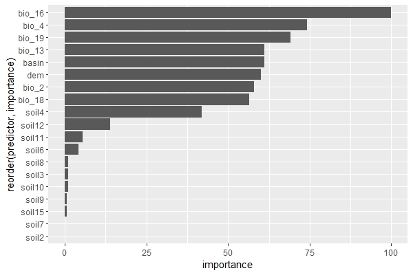

# Regression
## Loading packages
```{r message=FALSE, warning=FALSE}
pkg <- c("hydroGOF", "caret", "sf", "stringr", "geobr", "readxl", "dplyr", "terra", "parallelly", "parallel", "doParallel", "DescTools", "tidyr")

sapply(pkg, require, character.only = T)
```

## Cleaning the environment (removing objects and previously loaded packages)
```{r}
rm(list = ls())  
gc()
```

## Parameterization
```{r message=FALSE, warning=FALSE}
path_raiz <- "C:/R/pedometrics/regression/"
setwd(path_raiz)


# Number of repetitions
nruns <- 100

# Number of folds in RFE (for cross-validation)
fold_rfe <- 10

# Number of repetitions for RFE execution (> 1 for repeated cross-validation)
rep_rfe <- 1

# Metric used for model optimization
metric_otm <- "MAE"

# Number os subsets of covariates in the RFE 
size_rfe <- c(seq(2, 14, 1), seq(15, 29, 2), seq(30, 59, 20), seq(60, 120, 30))

# Number of tries for hyperparameter tuning in the RFE
tn_length_rfe <- 4

# Number of tries for hyperparameter tuning in the modelling
tn_length <- 10

# Number of folds in the modelling (for cross-validation)
fold_model <- 10

# Number of repetitions for Modelling 
rep_model <- 10

# Performance loss tolerance to select the best subset of predictors (in %)
tol_per <- 2

# Used models (see available models in caret documentation)
models <- c("rf")


# Selecting the name of the target variable to be modeled
varsy <- read.csv2("./extract_xy/ph_h2o_yx.csv") %>% 
  names() %>% 
  .[1]

# Defining the names of factor predictors
varfact <- c("curvature_classification", "geology", "geomorphons", "landforms_tpi_based", "surface_specific_points", "rookeries",  "terrain_surface_classification_iwahashi", "valley_idx", "vegetation") %>% sort()

# Setting a cluster of cores for parallel running
cl <- parallel::makeCluster(15)
cl <- parallelly::autoStopCluster(cl)
```


## Code execution
```{r eval=FALSE, message=FALSE, warning=FALSE, include=TRUE}
for (i in seq_along(models)) {
  
  tmodel <- Sys.time()
  
  
  for (j in seq_along(varsy)) {
    
    # Results folder
    path_results <- "C:/R/pedometrics/regression/results/"
    
    tvar <- Sys.time()
    
    # Loading the dataset (table) with samples and covariates values
    dfbase <- read.csv2("./extract_xy/ph_h2o_yx.csv")
    
    # Creating a dataframe to store performance results
    dfperf <- data.frame(model = integer(nruns),
                         var = integer(nruns),
                         n_train = integer(nruns),
                         MAE_train = integer(nruns),
                         RMSE_train = integer(nruns),
                         NSE_train = integer(nruns),
                         PBIAS_train = integer(nruns),
                         aPBIAS_train = integer(nruns),
                         Rsquared_train = integer(nruns),
                         CCC_train = integer(nruns),
                         n_test = integer(nruns),
                         MAE_test = integer(nruns),
                         RMSE_test = integer(nruns),
                         NSE_test = integer(nruns),
                         PBIAS_test = integer(nruns),
                         aPBIAS_test = integer(nruns),
                         Rsquared_test = integer(nruns),
                         CCC_test = integer(nruns),
                         MAE_null_train = integer(nruns),
                         RMSE_null_train = integer(nruns),
                         MAE_null_test = integer(nruns),
                         RMSE_null_test = integer(nruns))
    
    var <- varsy[j]
    
    
    # Creating a folder to store individual model results
    if (!dir.exists(paste0(path_results, models[i]))) {
      dir.create(paste0(path_results, models[i]))
    }
    
    
    if (!dir.exists(paste0(path_results, models[i], "/", var))) {
      dir.create(paste0(path_results, models[i], "/", var))
    }
    
    
    
    path_results <- paste0(path_results, models[i], "/", var, "/")
    
    
    if (!dir.exists(paste0(path_results, "select"))) {
      dir.create(paste0(path_results, "select"))
    }
    
    if (!dir.exists(paste0(path_results, "select/cor"))) {
      dir.create(paste0(path_results, "select/cor"))
    }
    
    if (!dir.exists(paste0(path_results, "select/rfe"))) {
      dir.create(paste0(path_results, "select/rfe"))
    }
    
    if (!dir.exists(paste0(path_results, "select/rfe/metric"))) {
      dir.create(paste0(path_results, "select/rfe/metric"))
    }
    
    if (!dir.exists(paste0(path_results, "select/rfe/select"))) {
      dir.create(paste0(path_results, "select/rfe/select"))
    }
    
    if (!dir.exists(paste0(path_results, "select/rfe/metric/", var))) {
      dir.create(paste0(path_results, "select/rfe/metric/", var))
    }
    
    if (!dir.exists(paste0(path_results, "select/rfe/select/", var))) {
      dir.create(paste0(path_results, "select/rfe/select/", var))
    }
    
    if (!dir.exists(paste0(path_results, "performance"))) {
      dir.create(paste0(path_results, "performance"))
    }
    
    if (!dir.exists(paste0(path_results, "performance/csv"))) {
      dir.create(paste0(path_results, "performance/csv"))
    }
    
    if (!dir.exists(paste0(path_results, "performance/imp_pred"))) {
      dir.create(paste0(path_results, "performance/imp_pred"))
    }
    
    if (!dir.exists(paste0(path_results, "performance/imp_pred/", var))) {
      dir.create(paste0(path_results, "performance/imp_pred/", var))
    }
    
    if (!dir.exists(paste0(path_results, "img"))) {
      dir.create(paste0(path_results, "img"))
    }
    
    
    
    dy <- dfbase %>% dplyr::select({var})
    dx <- dfbase %>% dplyr::select(-{varsy})
    
    
    
    dyx_sel <- cbind(dy, dx) %>% 
      filter(!!sym(var) > 0) %>% 
      na.omit()
    
    dyx_sel <- dyx_sel %>% 
      mutate_at(.vars = varfact, as.factor)
    
    
    # Removing predictors with a near zero variance
    dyx_sel <- dyx_sel %>% 
      dplyr::select(-one_of(nearZeroVar(., names = T)))
    
    
    # Removing predictors by spearman correlation > |0.95|
    mcor <- dyx_sel %>% dplyr::select(-one_of(var)) %>%
      dplyr::select_if(is.numeric) %>% 
      cor(method = "spearman")
    
    fc <- findCorrelation(mcor, cutoff = 0.95, names = T)
    
    data.frame(fc) %>% 
      `colnames<-`(paste0("rem_cor_", var)) %>% 
      write.csv2(file = paste0(path_results, "select/cor/", var,
                               "_cor", ".csv"), row.names = F)
    
    
    dyx_sel <- dyx_sel %>% dplyr::select(-one_of(fc))
    
    
    set.seed(666)
    nseed <- sample(1:100000, nruns)
    
    # Creating a list with the trained models
    lmodel <- list()
    lpredimp <- list()
    
    
    lrfepred <- list()
    lrferes <- list()
    
    
    
    
    for (n in 1:nruns) {
      
      trun <- Sys.time()
      
      status_run <- paste(trun, models[i], var, "run", n, "missing", nruns - n)
      
      print(status_run)
      
      set.seed(nseed[n])
      
      # Splitting the dataset into training set (80%) and testing set (20%)
      vf <- createDataPartition(dyx_sel[, var], p = 0.8, list = F)
      
      
      train <- dyx_sel[vf,]
      test <- dyx_sel[-vf,]
      
      
      registerDoParallel(cl)
      set.seed(nseed[n])
      
      # Recursive Feature Elimination
      rfe_ctrl <- rfeControl(method = "repeatedcv", 
                             repeats = rep_rfe,
                             number = fold_rfe,
                             verbose = F)
      
      set.seed(nseed[n])
      model_ctrl <- trainControl(method = "repeatedcv", 
                                 number = fold_rfe,
                                 repeats = rep_rfe
      )
      
      formu <- as.formula(paste(var, "~ ."))
      
      
      set.seed(nseed[n])
      rfe_fit <- rfe(form = formu,
                     data = train,
                     sizes = size_rfe,
                     method = models[i],
                     metric = metric_otm,
                     trControl = model_ctrl,
                     tuneLength = tn_length_rfe,
                     rfeControl = rfe_ctrl,
                     maximize = ifelse(metric_otm %in% c("RMSE", "MAE"),
                                       FALSE, TRUE))
      
      print(rfe_fit)
      print("-----------------------------------------------------------------")
      status_rfe <- paste("RFE run", models[i], var, n, round(Sys.time() - trun, 2),
                          units(Sys.time() - trun))
      
      print(status_rfe)
      
      
      lrferes[[n]] <- rfe_fit$result
      
      # Applying the loss of performance criterion 
      pick <- caret::pickSizeTolerance(x = lrferes[[n]],
                                       metric = metric_otm,
                                       tol = tol_per,
                                       maximize = ifelse(
                                         metric_otm %in% c("RMSE", "MAE"),
                                         FALSE, TRUE))
      lrfepred[[n]] <- rfe_fit$optVariables[1:pick]
      print(paste("select", pick))
      print("-----------------------------------------------------------------")
      
      
      
      # Unique names for categorical variables
      if (grepl(x = paste(lrfepred[[n]], collapse = " "),
                pattern = paste(varfact, collapse = "|"))) {
        
        for (h in seq_along(varfact)) {
          cf <- data.frame(vsel_rfe = lrfepred[[n]]) %>% 
            mutate(vsel_rfe = str_replace(vsel_rfe, paste0(".*", varfact[h], ".*"),
                                          varfact[h])) %>% 
            filter(!str_detect(vsel_rfe, paste(varfact[-h], collapse = "|"))) %>% 
            unique() %>% 
            pull()
          
          if (h == 1){
            
            cff <- cf
            
          } else {
            
            cff <- c(cff, cf)
            
          }
        }
        
        lrfepred[[n]] <- unique(cff)
        
      }
      
      
      write.csv2(data.frame(lrferes[[n]]),
                 file = paste0(path_results, "select/rfe/metric/", var,
                               "/RFE_", "R2_MAE_RMSE_", n, ".csv"), row.names = F)
      
      write.csv2(data.frame(pred_sel = lrfepred[[n]]),
                 file = paste0(path_results, "select/rfe/select/", var,
                               "/RFE_", "pred_sel_", n, ".csv"), row.names = F)
      
      # Taking variables chosen by RFE for model training
      dfselrfe <- train %>% dplyr::select({var}, one_of(lrfepred[[n]]))
      
      
      
      set.seed(nseed[n])
      model_ctrl <- trainControl(method = "repeatedcv", 
                                 number = fold_model,
                                 savePredictions = T,
                                 repeats = rep_model
      )
      
      formu <- as.formula(paste(var, "~ ."))
      registerDoParallel(cl)
      set.seed(nseed[n])
      
      # Model training
      model_fit <- train(form = formu,
                         data = dfselrfe,
                         metric = metric_otm,
                         method = if (models[i] %in% c("gbm_custom")){
                           get(models[i])
                         } else {
                           models[i]
                         }, 
                         trControl = model_ctrl,
                         tuneLength = tn_length,
                         # importance = T,
                         maximize = ifelse(
                           metric_otm %in% c("RMSE", "MAE"), FALSE, TRUE))
      
      print(model_fit)
      print("-----------------------------------------------------------------")
      status_model <- paste(model_fit[["modelInfo"]][["label"]], var, n,
                            round(Sys.time() - trun, 2),
                            units(Sys.time() - trun))
      
      print(status_model)
      print("-----------------------------------------------------------------")
      
      lmodel[[n]] <- model_fit
      
      # Calculating performance metrics
      pr_train <- getTrainPerf(lmodel[[n]])
      
      pr_test <- predict(lmodel[[n]], test) %>% 
        postResample(pred =  ., obs = test[, var])
      
      
      
      
      ccc_train <- CCC(train[,var], predict(lmodel[[n]], train),
                       conf.level = 0.95)
      
      ccc_test <- CCC(test[,var], predict(lmodel[[n]], test),
                      conf.level = 0.95)
      
      
      
      
      pr_null_train = rep(mean(train[, var]), nrow(train)) %>% 
        postResample(pred = ., obs = train[, var])
      
      pr_null_test = rep(mean(test[, var]), nrow(test)) %>% 
        postResample(pred = ., obs = test[, var])
      
      
      
      
      nse_train <- NSE(sim = as.data.frame(predict(lmodel[[n]], train)),
                       obs = train[,var], na.rm = T)
      
      nse_test <- NSE(sim = as.data.frame(predict(lmodel[[n]], test)),
                      obs = test[,var], na.rm = T)
      
      
      
      
      pbias_train <- pbias(sim = as.data.frame(predict(lmodel[[n]], train)),
                           obs = train[,var], na.rm = T)
      
      pbias_test <- pbias(sim = as.data.frame(predict(lmodel[[n]], test)),
                          obs = test[,var], na.rm = T)
      
      
      
      
      apbias_train <- pbias(sim = as.data.frame(predict(lmodel[[n]], train)),
                            obs = train[,var], na.rm = T) %>% abs()
      
      apbias_test <- pbias(sim = as.data.frame(predict(lmodel[[n]], test)),
                           obs = test[,var], na.rm = T) %>% abs()
      
      
      
      
      
      pred_imp <- varImp(lmodel[[n]])
      
      
      # Calculating importance of predictors
      lpredimp[[n]] <- data.frame(pred_imp[1]) %>% 
        mutate(predictor = row.names(.),
               importance = Overall) %>% 
        dplyr::select(-Overall) %>% 
        relocate(predictor)
      
      
      # Plotting predictor importance
      gg <-  ggplot(lpredimp[[n]], aes(y = reorder(predictor, importance), x = importance)) +
        geom_col()
      
      print(gg)
      
      
      write.csv2(lpredimp[[n]],
                 paste0(path_results, "performance/imp_pred/", var, "/",
                        "imp_pred_", n, ".csv"), row.names = F)
      
      
      # Filling the dataframe with the performances of models
      dfperf$model[n] <- lmodel[[n]][["modelInfo"]][["label"]]
      dfperf$var[n] <- var
      dfperf$n_train[n] <- nrow(train)
      dfperf$MAE_train[n] <- pr_train$TrainMAE
      dfperf$RMSE_train[n] <- pr_train$TrainRMSE
      dfperf$Rsquared_train[n] <- pr_train$TrainRsquared
      dfperf$n_test[n] <- nrow(test)
      dfperf$MAE_test[n] <- pr_test["MAE"]
      dfperf$RMSE_test[n] <- pr_test["RMSE"]
      dfperf$Rsquared_test[n] <- pr_test["Rsquared"]
      dfperf$MAE_null_train[n] <- pr_null_train["MAE"]
      dfperf$RMSE_null_train[n] <- pr_null_train["RMSE"]
      dfperf$MAE_null_test[n] <- pr_null_test["MAE"]
      dfperf$RMSE_null_test[n] <- pr_null_test["RMSE"]
      dfperf$CCC_train[n] <- ccc_train$rho.c$est
      dfperf$CCC_test[n] <- ccc_test$rho.c$est
      dfperf$NSE_train[n] <- nse_train
      dfperf$NSE_test[n] <- nse_test
      dfperf$PBIAS_train[n] <- pbias_train
      dfperf$PBIAS_test[n] <- pbias_test
      dfperf$aPBIAS_train[n] <- apbias_train
      dfperf$aPBIAS_test[n] <- apbias_test
      
      
      write.csv2(dfperf, row.names = F, paste0(
        path_results, "performance/csv/", var, "_performance", ".csv"))
      
      save.image(paste0(path_results, "img/", var, ".RData"))
      
      gc()
    }
    
    
    # save select rfe -------------------------------------------------
    n_obs <- sapply(lrfepred, length)
    seq.max <- seq_len(max(n_obs))
    
    rfe_pred_full <- as.data.frame(sapply(lrfepred, "[", i = seq.max))
    
    
    write.csv2(rfe_pred_full, row.names = F,
               file = paste0(
                 path_results, "select/rfe/select/", var, "/select_TOTAL",
                 ".csv"))
    
    
    
    # save geral rfe ----------------------------------------------- 
    n_rep <- rep(1:nruns, times = sapply(lrferes, nrow))
    rfe_res_full <- do.call(rbind, lrferes)
    
    rfe_res_full <- rfe_res_full %>% 
      mutate(rep = n_rep) %>% 
      relocate(rep)
    
    
    write.csv2(rfe_res_full, row.names = F,
               file = paste0(
                 path_results, "select/rfe/metric/", var, "/R2_MAE_RMSE_TOTAL",
                 ".csv"))
    
    
    # save predict importance -------------------------------------
    n_rep <- rep(1:nruns, times = sapply(lpredimp, nrow))
    pred_imp_full <- do.call(rbind, lpredimp)
    
    pred_imp_full <- pred_imp_full %>% 
      mutate(rep = n_rep) %>% 
      relocate(rep)
    
    
    write.csv2(pred_imp_full, row.names = F,
               file = paste0(
                 path_results, "performance/imp_pred/", var, "/imp_pred_TOTAL",
                 ".csv"))
    
    status_var <- paste(model_fit[["modelInfo"]][["label"]], var,
                        round(Sys.time() - tvar, 2),
                        units(Sys.time() - tvar))
    
    
    print(status_var)
    
    
  }
  
  status_model_full <- paste(model_fit[["modelInfo"]][["label"]], 
                             round(Sys.time() - tmodel, 2),
                             units(Sys.time() - tmodel))
  
  print(status_model_full)
  
}
```
<p align="center">

</p>


